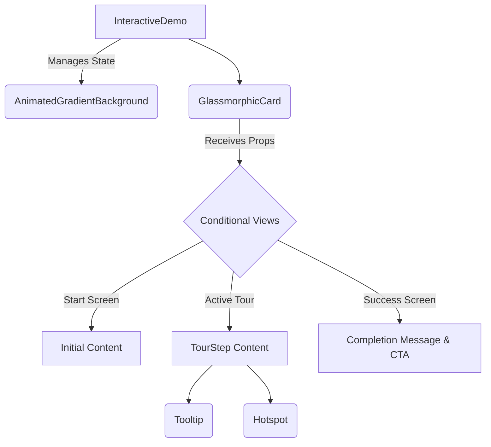

# InteractiveDemo Component Redesign: Implementation Plan

## 1. Overview and Goals

This document outlines the implementation plan for the strategic redesign of the `InteractiveDemo` component. The primary goal is to transform the current static placeholder into a dynamic, engaging, and visually modern "micro-demo." This redesign will serve as a powerful tool to capture user interest, showcase the product's value proposition, and guide users toward conversion.

The new component will be built upon two core aesthetic principles: **Animated Gradients** and **Glassmorphism**, creating a premium and interactive user experience.

## 2. Proposed Component Architecture

A modular, component-based architecture will be adopted to ensure reusability, maintainability, and a clear separation of concerns.



*   **`<InteractiveDemo>`:** The stateful parent component. It will manage the tour's state (e.g., `currentStep`, `isTourActive`) using React hooks and pass down props to its presentational children.
*   **`<AnimatedGradientBackground>`:** A reusable, purely presentational component responsible for rendering the animated CSS gradient. It will accept configuration options (colors, speed) via props.
*   **`<GlassmorphicCard>`:** The main UI container. This stateless component will receive the tour state as props and conditionally render the appropriate view (e.g., the initial start screen, the active tour steps, or the final success message).
*   **`<Tooltip>` / `<Hotspot>`:** Small, reusable components used to guide the user during the interactive tour. Their content and positioning will be driven by the `currentStep` data passed from the `InteractiveDemo` parent.

## 3. State Management Strategy

We will use React's built-in state management capabilities (`useState`, `useEffect`) and TypeScript for type safety.

### TypeScript Interfaces

The following interfaces will be defined within `src/components/InteractiveDemo.tsx` to ensure a well-structured and predictable state:

```typescript
interface TourStep {
  id: number;
  title: string;
  description: string;
  targetElementSelector?: string; // For positioning the tooltip/hotspot
}

interface InteractiveState {
  currentStep: number;
  isTourActive: boolean;
  isTourCompleted: boolean;
}
```

A `tourSteps` array, conforming to the `TourStep[]` type, will serve as the single source of truth for the guided tour's content.

## 4. Styling with Emotion

The visual redesign will be implemented using **Emotion**, leveraging the existing theme structure to maintain brand consistency across light and dark modes.

*   **Animated Gradient:** A `styled` component (`<AnimatedGradientBackground>`) will be created. It will use a `linear-gradient` with a `background-size` of `400% 400%` and a CSS `@keyframes` animation to smoothly transition the `background-position`. Colors will be sourced directly from `props.theme.colors`.
*   **Glassmorphism:** A `styled` component (`<GlassmorphicCard>`) will be created. It will achieve the glass effect using the following CSS properties:
    *   `background`: A semi-transparent color from the theme (e.g., `rgba(255, 255, 255, 0.25)`).
    *   `backdrop-filter`: `blur(10px)`.
    *   `border`: A subtle, 1px semi-transparent border.
    *   `box-shadow`: A soft glow to lift the element off the background, sourced from `props.theme.shadows`.

## 5. Microinteractions and Guided Tour Logic

The implementation will be phased to bring the component to life.

1.  **Hover State:** Implement the "magnetic card" effect on `<GlassmorphicCard>` using `transform: translateZ(10px)` and a subtle border glow on `:hover`.
2.  **Tour Activation:** An `onClick` handler on the initial view of the `<GlassmorphicCard>` will set `isTourActive` to `true`, triggering the rendering of the first tour step.
3.  **Guided Tour Logic:**
    *   A `handleNextStep` function will increment the `currentStep` in the state.
    *   The `<GlassmorphicCard>` and `<Tooltip>` components will re-render based on the updated `currentStep`, displaying the new content.
    *   The tour will utilize "directed actions," requiring the user to click on a highlighted element (a `<Hotspot>`) to proceed, rather than a generic "Next" button.
4.  **Success State:** Upon completing the final step, `isTourCompleted` will be set to `true`. This will trigger a celebratory animation (e.g., a checkmark appearing) and a call-to-action (CTA) button.
5.  **CTA and Smooth Scroll:** The final CTA button (e.g., "See Plans & Pricing") will, when clicked, use `element.scrollIntoView({ behavior: 'smooth' })` to smoothly navigate the user to the `<PricingTable>` section of the page.

## 6. Accessibility (A11y) and Performance

*   **Accessibility:**
    *   **Contrast:** All text will be tested to ensure it meets WCAG AA contrast ratios against the glassmorphic background.
    *   **ARIA:** ARIA attributes will be used to communicate the state of interactive elements to screen readers.
    *   **Skip Tour:** A clearly visible "Skip Tour" button will be available at all times.
*   **Performance:**
    *   **GPU Acceleration:** All animations will exclusively use GPU-accelerated CSS properties (`transform`, `opacity`).
    *   **No Color Animation:** We will avoid animating gradient colors directly, as this is a CPU-intensive operation that can lead to janky animations.

## 7. Phased Implementation Roadmap

1.  **Phase 1: Foundation & Visuals (1-2 days)**
    *   Implement the new component architecture (`<InteractiveDemo>`, `<AnimatedGradientBackground>`, `<GlassmorphicCard>`).
    *   Implement the animated gradient and glassmorphism styles.
2.  **Phase 2: State Management & Tour Logic (2-3 days)**
    *   Implement the state management hooks and TypeScript interfaces.
    *   Create the `tourSteps` data structure.
    *   Implement the guided tour logic, including the rendering of `<Tooltip>` and `<Hotspot>` components.
3.  **Phase 3: Microinteractions & Polish (1-2 days)**
    *   Add the hover effects, success animation, and smooth scroll functionality.
    *   Refine the overall user experience and visual polish.
4.  **Phase 4: A11y & Performance Review (1 day)**
    *   Conduct a thorough review of the component's accessibility and performance.
    *   Implement any necessary improvements based on the review.