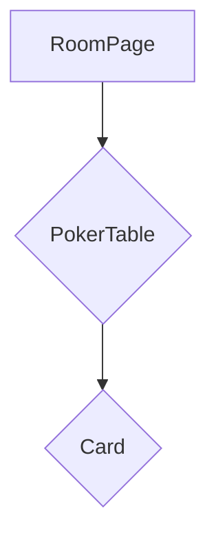

# Plan de Implementación: Vista de Mesa de Póker

---

### **1. Resumen de la Tarea**

El objetivo es reemplazar la vista actual de las cartas de los participantes, que se muestran en una fila, por una disposición que simule una mesa de póker. Los participantes (y sus votos) se distribuirán circularmente alrededor de una mesa ovalada en el centro de la pantalla.

---

### **2. Archivos a Crear y Modificar**

1.  **Archivo Nuevo**: `src/components/features/room/PokerTable.tsx`
2.  **Archivo a Modificar**: `src/app/[lang]/room/[roomId]/page.tsx`

---

### **3. Diagrama de Componentes**



---

### **4. Plan de Implementación Detallado**

#### **Paso 1: Crear el Componente `PokerTable.tsx`**

**Ubicación**: `src/components/features/room/PokerTable.tsx`

**Código de Esqueleto**:

```tsx
// src/components/features/room/PokerTable.tsx
import React, { useRef, useLayoutEffect, useState } from 'react';
import { Box, Typography, useTheme } from '@mui/material';
import Card from '@/components/core/Card';
import { Participant, Vote } from '@/types/room';

interface PokerTableProps {
  participants: Participant[];
  votes: { [participantId: string]: Vote };
  reveal: boolean;
  currentIssueId: string | null;
}

const PokerTable: React.FC<PokerTableProps> = ({ participants, votes, reveal }) => {
  const theme = useTheme();
  const tableRef = useRef<HTMLDivElement>(null);
  const [dimensions, setDimensions] = useState({ width: 0, height: 0 });

  useLayoutEffect(() => {
    if (tableRef.current) {
      setDimensions({
        width: tableRef.current.offsetWidth,
        height: tableRef.current.offsetHeight,
      });
    }
  }, []);

  const { width, height } = dimensions;
  const horizontalRadius = width / 2;
  const verticalRadius = height / 2;

  const cardScale = Math.min(1, Math.max(0.5, 1 - (participants.length - 6) * 0.05));

  return (
    <Box 
      ref={tableRef}
      sx={{
        position: 'relative',
        width: { xs: '90vw', md: '70vw' },
        maxWidth: '800px',
        aspectRatio: '16 / 9',
        margin: '50px auto',
        backgroundColor: theme.palette.success.dark,
        borderRadius: '50%',
        border: `10px solid ${theme.palette.warning.dark}`,
      }}
    >
      {participants.map((participant, index) => {
        const angle = (index / participants.length) * 2 * Math.PI;
        const cardWidth = 80 * cardScale;
        const cardHeight = 120 * cardScale;
        const left = horizontalRadius + (horizontalRadius * 0.9) * Math.cos(angle) - (cardWidth / 2);
        const top = verticalRadius + (verticalRadius * 0.9) * Math.sin(angle) - (cardHeight / 2);

        const participantVote = votes[participant.id]?.value;

        return (
          <Box
            key={participant.id}
            sx={{
              position: 'absolute',
              left: `${left}px`,
              top: `${top}px`,
              textAlign: 'center',
              transform: `scale(${cardScale})`,
              transition: 'transform 0.3s ease',
            }}
          >
            <Typography variant="caption" sx={{ color: 'white', fontWeight: 'bold' }}>
              {participant.name}
            </Typography>
            <Card
              value={reveal ? participantVote : (participantVote ? '✓' : '?')}
              isSelected={false}
              flipped={reveal}
            />
          </Box>
        );
      })}
    </Box>
  );
};

export default PokerTable;
```

#### **Paso 2: Integrar `<PokerTable />` en `RoomPage`**

1.  **Importar el componente** en `src/app/[lang]/room/[roomId]/page.tsx`:
    ```tsx
    import PokerTable from '@/components/features/room/PokerTable';
    ```

2.  **Reemplazar el bloque de participantes** (líneas ~732 a ~830) con el nuevo componente:
    ```tsx
    <PokerTable
      participants={participants}
      votes={votes}
      reveal={reveal}
      currentIssueId={currentIssueId}
    />
    ```

---

### **5. Estrategia de Responsividad y Escalabilidad**

1.  **Dimensiones Flexibles**: La mesa usará `vw` con un `maxWidth` y `aspectRatio` para adaptarse a cualquier pantalla.
2.  **Medición Dinámica**: `useLayoutEffect` medirá el tamaño real del DOM para un posicionamiento preciso.
3.  **Escalado de Cartas**: El tamaño de las cartas se reducirá dinámicamente (`transform: scale(...)`) a medida que aumente el número de participantes para evitar la superposición.